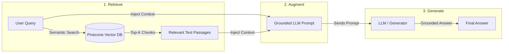
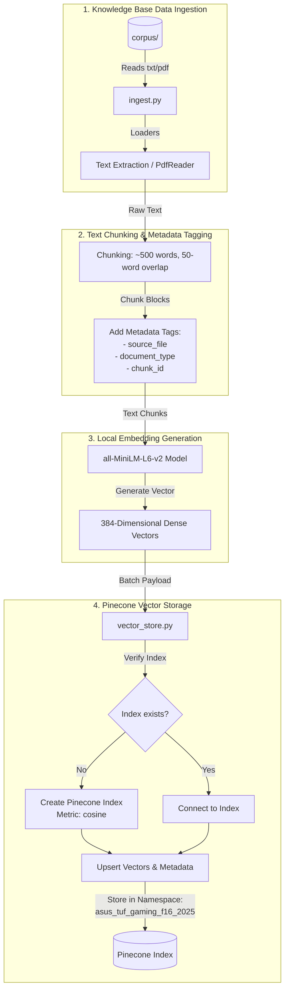
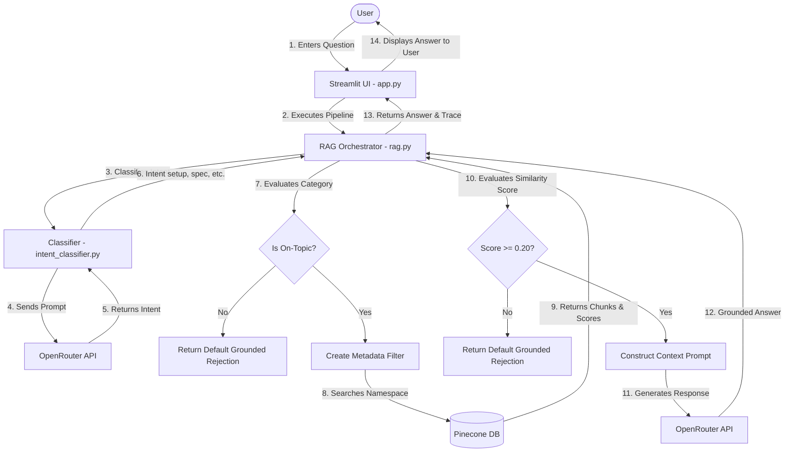
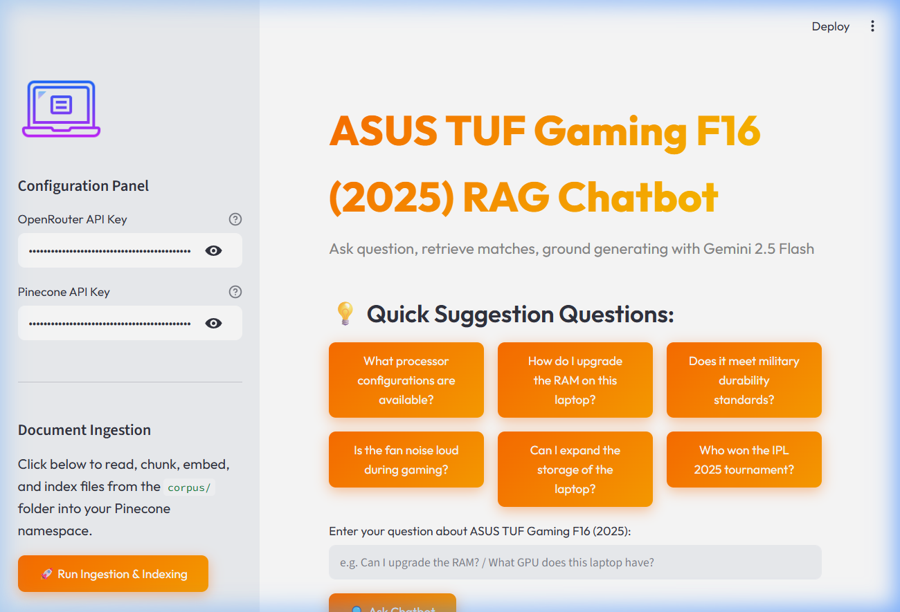
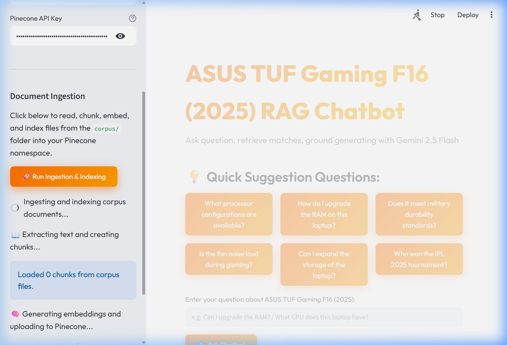
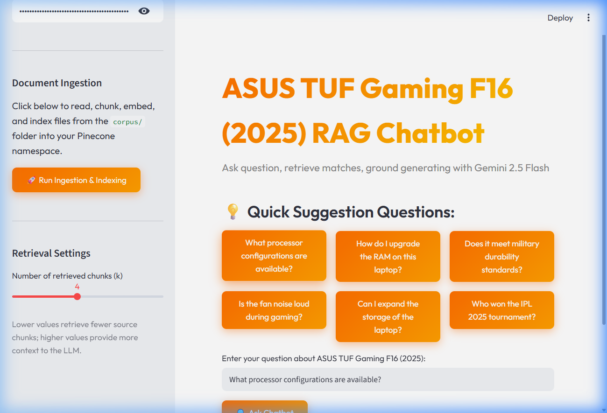

# ASUS TUF Gaming F16 (2025) RAG Chatbot

An end-to-end Retrieval-Augmented Generation (RAG) chatbot designed in Python and Streamlit to answer user queries exclusively about the **ASUS TUF Gaming F16 (2025)** laptop. 

This project demonstrates the complete RAG pipeline: document ingestion, text chunking, local sentence-embedding generation, Pinecone index storage, LLM-based query intent classification, dynamic retrieval filtering, grounded LLM generation, and guardrail validation.

---

## Project Structure

```
asus_tuf_rag_project/
├── app.py                   # Streamlit UI & interactive frontend
├── ingest.py                # File reader, PDF extractor, text chunker, and metadata generator
├── vector_store.py          # Embedding generation & Pinecone integration (dimension 384, cosine metric)
├── intent_classifier.py     # Gemini Flash intent classification via OpenRouter
├── rag.py                   # Core orchestrator executing the retrieval and LLM generation
├── requirements.txt         # Required Python packages
├── README.md                # Documentation and setup instructions
└── corpus/                  # Local knowledge base
    ├── official_specs.txt   # Specs sheet for models, OS, CPU, RAM, etc.
    ├── user_manual.pdf      # Detailed ASUS manual PDF
    ├── faq.txt              # Standard Q&A on upgrades, connections, durability
    └── reviews.txt          # Combined list of positive and negative reviews
```

---

## System Architecture

The chatbot is built using the **Retrieval-Augmented Generation (RAG)** architecture. Below are the diagrams explaining the core concept, the ingestion infrastructure, and the end-user query workflows:

### 1. The Core RAG Concept (Retrieve -> Augment -> Generate)

Unlike standard LLMs that answer queries from static pre-trained weights, a RAG system first **retrieves** relevant document chunks from a custom database, **augments** the user's prompt with this real-time context, and then passes it to the LLM to **generate** a grounded response.



### 2. Ingestion & Indexing Pipeline (Infrastructure Build)

This pipeline reads raw text and PDF documents, segments them into overlap-protected chunks, extracts metadata tags, generates vector representations locally, and indexes them in Pinecone:



### 3. Real-time Query & Generation Pipeline (End-User Workflow)

This pipeline handles user interaction, categorizes user intent to apply dynamic filters, queries the Pinecone vector index, applies relevancy score guardrails, and constructs grounded responses using OpenRouter:



### Key Architectural Layers
1. **Frontend Layer (`app.py`)**: Built with Streamlit, incorporating modern CSS (dark theme, orange accent buttons, glassmorphic cards). It captures credentials, triggers manual document ingestion, and renders response blocks with internal pipeline diagnostics (retrieved chunk sources, score distributions, and intents).
2. **Orchestration Layer (`rag.py`)**: The central pipeline. It runs sequential stages, evaluating guardrails and fallbacks, and handles connection timeouts or Rate Limits (`429`) with automatic exponential backoffs.
3. **Intent Classification (`intent_classifier.py`)**: Categorizes questions beforehand to restrict the semantic search space to specific document types, filtering out background noise.
4. **Vector Database Layer (`vector_store.py`)**: Responsible for embedding text chunks utilizing `all-MiniLM-L6-v2` locally and performing high-performance cosine-similarity lookups in the Pinecone cloud.

---

## Project Screenshots

### 1. Main Application Dashboard


### 2. Live Document Ingestion & Pinecone Upload


### 3. Pipeline Diagnostics and Retrieval Trace


---

## RAG Pipeline Stages Explained

### 1. Ingestion (`ingest.py`)
- **Extraction**: Supports both `.txt` (UTF-8) and `.pdf` (using `pypdf`'s `PdfReader`) inputs.
- **Chunking**: Uses a word-based splitter (~500 words per chunk with a 50-word overlap) to segment large documents, ensuring context isn't lost across chunk boundaries.
- **Metadata**: Saves custom tags for every chunk:
  - `source_file`: The file name (e.g. `official_specs.txt`).
  - `document_type`: Broad categories mapping to `spec`, `manual`, `faq`, or `review`.
  - `chunk_id`: Standard uniquely identified string.

### 2. Embeddings & Vector Store (`vector_store.py`)
- **Embeddings**: Employs the `sentence-transformers/all-MiniLM-L6-v2` model, which generates 384-dimensional dense vectors representing the semantic meaning of chunks.
- **Pinecone**: Connects to Pinecone. Creates an index named `asus-tuf-gaming-f16-2025` using `cosine` distance metric if it doesn't already exist.
- **Self-contained Storage**: The raw text of each chunk is uploaded directly in Pinecone's vector metadata under the key `"text"`. This simplifies retrieval by eliminating the need for a secondary document lookup database.

### 3. Intent Detection (`intent_classifier.py`)
- User queries are classified before search into one of six categories:
  - `specifications`, `setup/how_to`, `troubleshooting`, `reviews_opinions`, `general_product_question`, or `out_of_scope`.
- Intent detection is handled via OpenRouter with the `google/gemini-2.5-flash` model.
- **Retrieval Filter**: Chunks are selectively queried depending on the intent:
  - `specifications` -> queries are filtered to search only `spec` or `faq` chunks.
  - `setup/how_to` & `troubleshooting` -> filtered to search `manual` or `faq` chunks.
  - `reviews_opinions` -> filtered to search only `review` chunks.
  - `general_product_question` -> searches across all chunks without filter.

### 4. RAG Orchestrator & Grounded Generation (`rag.py`)
- **Guardrails**:
  - **Out of Scope Check**: If the intent is `out_of_scope`, the chatbot immediately returns `"I don't know from the available info."` without retrieving documents or calling the LLM.
  - **Similarity Threshold**: If the highest matching similarity score in Pinecone is below `0.20`, the chatbot rejects the query and outputs `"I don't know from the available info."` to prevent hallucinations on irrelevant topics.
- **Fallback Search**: If search with an intent filter yields no results or very low scores, the system automatically runs a fallback query without any metadata filter to avoid missing key details.
- **Prompt Engineering**: The final LLM prompt includes context documents and enforces a strict system instruction: answer *only* from context and output exact rejection text if the information is missing.

### 5. Frontend UI (`app.py`)
- A single-page Streamlit dashboard featuring custom dark/glassmorphic CSS.
- **Controls**: Includes a sidebar for API key configuration and a one-click button to execute ingestion.
- **Suggestions**: Quick questions to try out intent-based filtering and out-of-scope rejections.
- **Trace Diagnostic**: An expandable section detailing the internal pipeline execution data (intent, fallback status, retrieved chunks, metadata, and scores) for interview demonstrations.

---

## Installation and Execution

### Step 1: Install Dependencies
Create your virtual environment, activate it, and install dependencies:
```bash
pip install -r requirements.txt
```

### Step 2: Configure Environment Variables
Create a file named `.env` in the project root folder (or edit the template created) and add your keys:
```env
GEMINI_API_KEY=your_openrouter_api_key_here
PINECONE_API_KEY=your_pinecone_api_key_here
```

### Step 3: Run the Streamlit Application
Start the frontend interface locally:
```bash
streamlit run app.py
```

### Step 4: Index the Knowledge Base
1. Open the Streamlit dashboard in your browser.
2. In the left sidebar, click the **"🚀 Run Ingestion & Indexing"** button.
3. This reads, chunks, generates embeddings, and indexes all 4 files into your Pinecone namespace `asus_tuf_gaming_f16_2025`.
4. Once completed, type any question in the input box and click **"🔍 Ask Chatbot"**.
